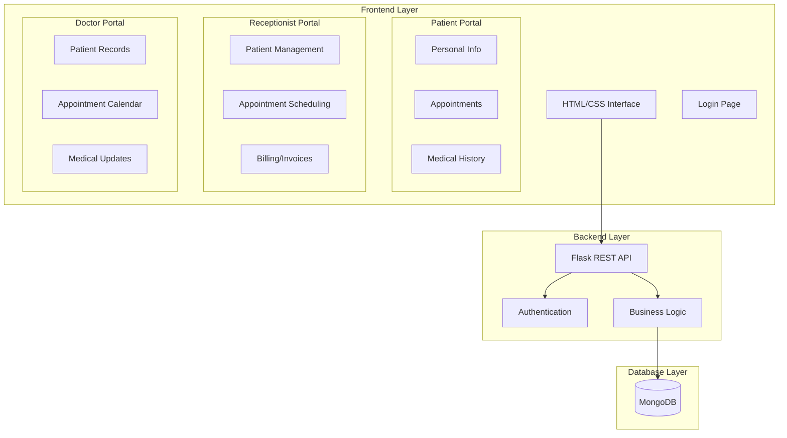
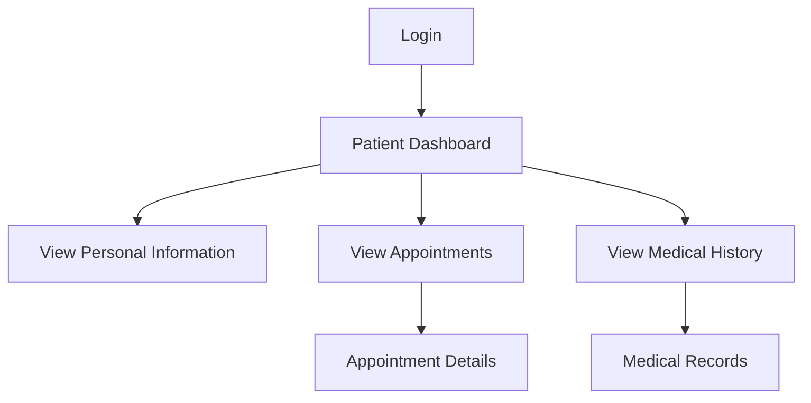
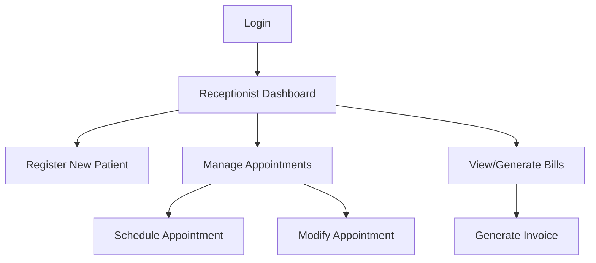
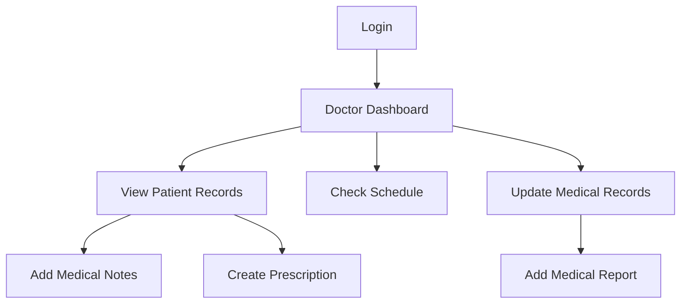

# Hospital Management System - Architecture Plan

## System Overview

This document outlines the architecture for a hospital management system with the following key components:
- Frontend: Pure HTML/CSS interface
- Backend: Python Flask application
- Database: MongoDB
- User Types: Patients, Receptionists, Doctors

## System Architecture



## Technical Stack

### Frontend
- Pure HTML5/CSS3
- Features:
  - Responsive design for all devices
  - Form validation using HTML5 attributes
  - Semantic HTML for better accessibility
  - CSS Grid/Flexbox for layouts
  - Mobile-first approach

### Backend
- Flask Framework
  - Flask-PyMongo for MongoDB integration
  - Flask-Login for session management
  - Flask-WTF for form handling and CSRF protection
- Features:
  - RESTful API endpoints
  - JWT authentication
  - Role-based access control
  - Input validation and sanitization
  - Error handling and logging

### Database
- MongoDB with the following collections:
  - Users (authentication)
  - Patients
  - Doctors
  - Receptionists
  - Appointments
  - Medical Reports
  - Medications
  - Services
  - Invoices
  - Prescriptions
  - Departments

## Project Structure

```
hospital-management-system/
├── frontend/
│   ├── static/
│   │   ├── css/
│   │   │   ├── main.css
│   │   │   ├── auth.css
│   │   │   └── dashboard.css
│   │   └── images/
│   ├── templates/
│   │   ├── base.html
│   │   ├── auth/
│   │   │   ├── login.html
│   │   │   └── reset_password.html
│   │   ├── patient/
│   │   │   ├── dashboard.html
│   │   │   ├── appointments.html
│   │   │   └── medical_history.html
│   │   ├── doctor/
│   │   │   ├── dashboard.html
│   │   │   ├── patient_records.html
│   │   │   └── schedule.html
│   │   └── receptionist/
│   │       ├── dashboard.html
│   │       ├── patient_registration.html
│   │       └── appointments.html
├── backend/
│   ├── app/
│   │   ├── __init__.py
│   │   ├── routes/
│   │   │   ├── auth.py
│   │   │   ├── patient.py
│   │   │   ├── doctor.py
│   │   │   └── receptionist.py
│   │   ├── models/
│   │   │   ├── user.py
│   │   │   ├── patient.py
│   │   │   └── appointment.py
│   │   ├── services/
│   │   │   ├── auth_service.py
│   │   │   ├── patient_service.py
│   │   │   └── appointment_service.py
│   │   └── utils/
│   │       ├── validators.py
│   │       └── helpers.py
│   ├── config/
│   │   ├── __init__.py
│   │   └── settings.py
│   └── tests/
│       ├── test_auth.py
│       ├── test_patient.py
│       └── test_appointment.py
└── requirements.txt
```

## User Workflows

### Patient Flow


### Receptionist Flow


### Doctor Flow


## Security Measures

1. Authentication:
   - Password hashing using bcrypt
   - JWT tokens for API authentication
   - Session management
   - Password reset functionality

2. Authorization:
   - Role-based access control (RBAC)
   - Route protection
   - Resource-level permissions

3. Data Protection:
   - Input validation and sanitization
   - CSRF protection
   - XSS prevention
   - SQL injection prevention
   - Secure headers

## Implementation Plan

### Phase 1: Foundation (Week 1)
- Project structure setup
- Database connection and schema implementation
- Basic authentication system
- Core user management

### Phase 2: Patient Module (Week 2)
- Patient dashboard development
- Appointment viewing functionality
- Medical history access
- Personal information management

### Phase 3: Receptionist Module (Week 2-3)
- Patient registration system
- Appointment scheduling
- Billing and invoice generation
- Patient search and management

### Phase 4: Doctor Module (Week 3-4)
- Patient record management
- Appointment calendar
- Medical report generation
- Prescription management

### Phase 5: Integration & Testing (Week 4-5)
- Module integration
- Security implementation
- User acceptance testing
- Performance optimization
- Bug fixing and refinements

## Testing Strategy

1. Unit Testing:
   - Individual component testing
   - Route testing
   - Model testing
   - Service testing

2. Integration Testing:
   - API endpoint testing
   - Database integration testing
   - Authentication flow testing

3. Security Testing:
   - Penetration testing
   - Authentication testing
   - Authorization testing
   - Input validation testing

## Deployment Considerations

1. Server Requirements:
   - Python 3.8+
   - MongoDB 4.4+
   - Nginx web server
   - SSL certificate

2. Environment Setup:
   - Development
   - Staging
   - Production

3. Monitoring:
   - Application logging
   - Error tracking
   - Performance monitoring
   - Database monitoring

## Future Enhancements

1. Additional Features:
   - Email notifications
   - SMS reminders
   - Report generation
   - Analytics dashboard

2. Technical Improvements:
   - Caching implementation
   - API rate limiting
   - Real-time updates
   - Mobile app integration