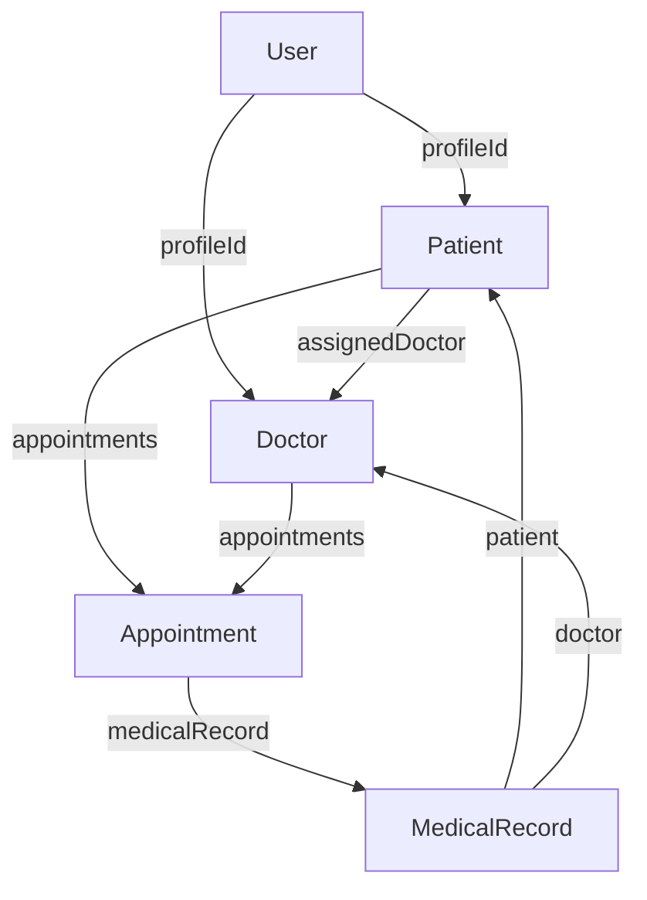

# Cấu Trúc Database MongoDB

## Tổng Quan Mối Quan Hệ



## Chi Tiết Các Collection

### 1. Users Collection
```javascript
{
  _id: ObjectId,
  username: String,         // Tên đăng nhập, unique
  password: String,         // Đã được mã hóa
  role: String,            // 'patient' | 'doctor' | 'receptionist'
  email: String,           // Email, unique
  phoneNumber: String,     // Số điện thoại
  profileId: ObjectId,     // Tham chiếu đến Patient hoặc Doctor
  createdAt: Date,
  updatedAt: Date
}
```

### 2. Patients Collection
```javascript
{
  _id: ObjectId,
  personalInfo: {
    fullName: String,      // Họ và tên
    dateOfBirth: Date,     // Ngày sinh
    gender: String,        // Nam/Nữ/Khác
    address: {
      street: String,      // Địa chỉ
      district: String,    // Quận/Huyện
      city: String         // Thành phố
    },
    bloodType: String      // Nhóm máu
  },
  medicalInfo: {
    allergies: [String],   // Danh sách dị ứng
    chronicConditions: [{  // Bệnh mãn tính
      condition: String,   // Tên bệnh
      diagnosedDate: Date, // Ngày chẩn đoán
      notes: String        // Ghi chú
    }],
    familyHistory: [{     // Tiền sử gia đình
      condition: String,  // Tên bệnh
      relationship: String, // Quan hệ
      notes: String       // Ghi chú
    }]
  },
  insurance: {
    provider: String,     // Nhà cung cấp bảo hiểm
    policyNumber: String, // Số bảo hiểm
    validUntil: Date     // Ngày hết hạn
  },
  emergencyContact: {
    name: String,        // Tên người liên hệ khẩn cấp
    relationship: String, // Mối quan hệ
    phoneNumber: String, // Số điện thoại
    address: String      // Địa chỉ
  },
  medicalRecords: [ObjectId], // Tham chiếu đến MedicalRecord
  appointments: [ObjectId],   // Tham chiếu đến Appointment
  assignedDoctor: ObjectId,   // Tham chiếu đến Doctor
  status: String,            // 'active' | 'inactive' | 'pending'
  createdAt: Date,
  updatedAt: Date
}
```

### 3. Doctors Collection
```javascript
{
  _id: ObjectId,
  personalInfo: {
    fullName: String,     // Họ và tên
    dateOfBirth: Date,    // Ngày sinh
    gender: String,       // Nam/Nữ/Khác
    phoneNumber: String,  // Số điện thoại
    email: String,       // Email
    address: {
      street: String,    // Địa chỉ
      district: String,  // Quận/Huyện
      city: String      // Thành phố
    }
  },
  professionalInfo: {
    specialization: String,  // Chuyên khoa
    qualifications: [{      // Bằng cấp
      degree: String,       // Tên bằng
      institution: String,  // Nơi cấp
      year: Number         // Năm cấp
    }],
    licenses: [{           // Giấy phép hành nghề
      type: String,        // Loại giấy phép
      number: String,      // Số giấy phép
      issuedDate: Date,    // Ngày cấp
      expiryDate: Date     // Ngày hết hạn
    }],
    experience: Number     // Số năm kinh nghiệm
  },
  schedule: {
    regularHours: [{      // Lịch làm việc thông thường
      day: String,        // Thứ trong tuần
      shifts: [{          // Ca làm việc
        start: String,    // Giờ bắt đầu
        end: String       // Giờ kết thúc
      }]
    }],
    exceptions: [{        // Ngoại lệ lịch làm việc
      date: Date,        // Ngày
      reason: String,    // Lý do
      isAvailable: Boolean // Có làm việc không
    }]
  },
  appointments: [ObjectId], // Tham chiếu đến Appointment
  patients: [ObjectId],    // Tham chiếu đến Patient
  department: String,      // Khoa
  status: String,         // 'active' | 'on-leave' | 'inactive'
  consultationFee: Number, // Phí khám
  averageConsultationTime: Number, // Thời gian khám trung bình (phút)
  statistics: {
    totalPatients: Number,         // Tổng số bệnh nhân
    averageRating: Number,         // Đánh giá trung bình
    consultationsThisMonth: Number // Số lượt khám tháng này
  },
  createdAt: Date,
  updatedAt: Date
}
```

### 4. Appointments Collection
```javascript
{
  _id: ObjectId,
  patient: ObjectId,     // Tham chiếu đến Patient
  doctor: ObjectId,      // Tham chiếu đến Doctor
  date: Date,           // Ngày hẹn
  timeSlot: {
    start: String,      // Giờ bắt đầu
    end: String         // Giờ kết thúc
  },
  type: String,         // 'new' | 'follow-up' | 'regular'
  status: String,       // 'scheduled' | 'completed' | 'cancelled' | 'no-show'
  department: String,   // Khoa
  reason: String,       // Lý do khám
  notes: {
    beforeAppointment: String, // Ghi chú trước khám
    afterAppointment: String   // Ghi chú sau khám
  },
  priority: String,     // 'normal' | 'urgent' | 'emergency'
  paymentStatus: String, // 'pending' | 'completed' | 'refunded'
  fee: {
    consultation: Number, // Phí khám
    medicines: Number,   // Phí thuốc
    tests: Number,      // Phí xét nghiệm
    total: Number       // Tổng phí
  },
  createdBy: ObjectId,  // Tham chiếu đến User tạo lịch hẹn
  createdAt: Date,
  updatedAt: Date
}
```

### 5. MedicalRecords Collection
```javascript
{
  _id: ObjectId,
  patient: ObjectId,    // Tham chiếu đến Patient
  doctor: ObjectId,     // Tham chiếu đến Doctor
  appointment: ObjectId, // Tham chiếu đến Appointment
  date: Date,          // Ngày khám
  visitType: String,    // 'initial' | 'follow-up' | 'emergency' | 'routine'
  chiefComplaint: String, // Lý do khám chính
  symptoms: [{
    description: String, // Mô tả triệu chứng
    duration: String,    // Thời gian
    severity: String     // 'mild' | 'moderate' | 'severe'
  }],
  diagnosis: {
    primary: String,    // Chẩn đoán chính
    secondary: [String], // Chẩn đoán phụ
    notes: String       // Ghi chú
  },
  vitals: {
    bloodPressure: {    // Huyết áp
      systolic: Number,
      diastolic: Number
    },
    temperature: Number, // Nhiệt độ
    pulse: Number,      // Mạch
    respiratoryRate: Number, // Nhịp thở
    weight: Number,     // Cân nặng
    height: Number,     // Chiều cao
    bmi: Number        // Chỉ số BMI
  },
  examinations: {
    physical: [{       // Khám thực thể
      area: String,    // Vùng khám
      findings: String, // Phát hiện
      notes: String    // Ghi chú
    }],
    notes: String      // Ghi chú chung
  },
  prescriptions: [{    // Đơn thuốc
    medicine: {
      name: String,    // Tên thuốc
      dosage: {
        amount: Number, // Liều lượng
        unit: String,   // Đơn vị
        frequency: String, // Tần suất
        duration: String  // Thời gian dùng
      },
      instructions: String, // Hướng dẫn
      quantity: Number    // Số lượng
    },
    status: String,    // 'active' | 'completed' | 'cancelled'
    notes: String      // Ghi chú
  }],
  testResults: [{      // Kết quả xét nghiệm
    testName: String,  // Tên xét nghiệm
    category: String,  // Loại xét nghiệm
    date: Date,       // Ngày xét nghiệm
    results: [{
      parameter: String, // Thông số
      value: String,    // Giá trị
      unit: String,     // Đơn vị
      normalRange: String, // Khoảng bình thường
      isAbnormal: Boolean // Có bất thường không
    }],
    conclusion: String, // Kết luận
    attachments: [{    // Tài liệu đính kèm
      filename: String, // Tên file
      url: String,     // Đường dẫn
      type: String     // Loại file
    }],
    performedBy: String // Người thực hiện
  }],
  treatment: {
    plan: String,      // Kế hoạch điều trị
    recommendations: [String], // Khuyến nghị
    followUp: {        // Tái khám
      required: Boolean, // Có cần tái khám không
      timeframe: String, // Khung thời gian
      notes: String     // Ghi chú
    }
  },
  attachments: [{      // Tài liệu đính kèm
    type: String,      // Loại tài liệu
    filename: String,  // Tên file
    url: String,       // Đường dẫn
    uploadedAt: Date,  // Ngày tải lên
    notes: String      // Ghi chú
  }],
  notes: {
    clinical: String,  // Ghi chú lâm sàng
    private: String    // Ghi chú riêng
  },
  status: String,      // 'draft' | 'final' | 'amended'
  createdAt: Date,
  updatedAt: Date
}
```

## Indexes

### Users Collection
```javascript
{ username: 1 }        // Unique index
{ email: 1 }          // Unique index
{ role: 1 }           // Regular index
```

### Patients Collection
```javascript
{ 'personalInfo.fullName': 'text' }  // Text index cho tìm kiếm
{ 'personalInfo.dateOfBirth': 1 }    // Regular index
{ status: 1 }                        // Regular index
```

### Doctors Collection
```javascript
{ 'personalInfo.fullName': 'text' }   // Text index cho tìm kiếm
{ 'professionalInfo.specialization': 1 } // Regular index
{ department: 1 }                     // Regular index
{ status: 1 }                        // Regular index
```

### Appointments Collection
```javascript
{ date: 1 }           // Regular index
{ patient: 1 }        // Regular index
{ doctor: 1 }         // Regular index
{ status: 1 }         // Regular index
{ department: 1 }     // Regular index
```

### MedicalRecords Collection
```javascript
{ patient: 1 }        // Regular index
{ doctor: 1 }         // Regular index
{ date: -1 }          // Regular index
{ 'diagnosis.primary': 'text' }  // Text index cho tìm kiếm
```

## Validation Rules

- Users: Username và email phải unique
- Appointments: Không được có conflict về thời gian với bác sĩ
- MedicalRecords: Chỉ bác sĩ được phân công mới có thể tạo/sửa
- Patients: Một bệnh nhân chỉ có một bác sĩ chính
- Doctors: Lịch làm việc không được conflict

## Quan Hệ Giữa Các Collection

1. User - Patient/Doctor (1:1)
   - Mỗi user có một profile (patient hoặc doctor)

2. Doctor - Patient (1:N)
   - Một bác sĩ có nhiều bệnh nhân
   - Một bệnh nhân có một bác sĩ chính

3. Patient/Doctor - Appointment (1:N)
   - Một bệnh nhân có nhiều lịch hẹn
   - Một bác sĩ có nhiều lịch hẹn

4. Appointment - MedicalRecord (1:1)
   - Mỗi lịch hẹn có thể có một hồ sơ khám bệnh

5. Patient - MedicalRecord (1:N)
   - Một bệnh nhân có nhiều hồ sơ khám bệnh