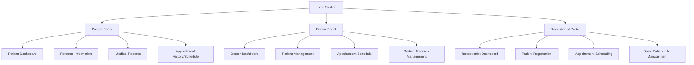

# Kế Hoạch Nâng Cấp Giao Diện Hệ Thống Quản Lý Phòng Khám

## Sơ Đồ Tổng Quan

## Chi Tiết Kế Hoạch Nâng Cấp

### 1. Cải Thiện Hệ Thống Xác Thực
- Thêm xác thực dựa trên vai trò (Bệnh nhân/Bác sĩ/Lễ tân)
- Triển khai quản lý phiên đăng nhập
- Thêm chức năng đăng ký cho bệnh nhân

### 2. Nâng Cấp Cổng Thông Tin Bệnh Nhân
#### Dashboard
- Hiển thị các cuộc hẹn sắp tới
- Hiển thị tóm tắt hồ sơ bệnh án mới nhất
- Hiển thị thông tin bác sĩ được phân công

#### Thông Tin Cá Nhân
- Hồ sơ bệnh nhân đầy đủ với tất cả các trường thông tin liên quan
- Phần lịch sử bệnh lý
- Thông tin liên hệ khẩn cấp

#### Xem Hồ Sơ Bệnh Án
- Danh sách tất cả các lần khám theo thứ tự thời gian
- Lịch sử kê đơn thuốc
- Kết quả xét nghiệm và chẩn đoán

#### Quản Lý Cuộc Hẹn
- Xem các cuộc hẹn sắp tới
- Lịch sử cuộc hẹn
- Khả năng yêu cầu cuộc hẹn mới

### 3. Nâng Cấp Cổng Thông Tin Bác Sĩ
#### Dashboard
- Lịch hẹn khám trong ngày
- Quản lý hàng đợi bệnh nhân
- Truy cập nhanh đến bệnh nhân gần đây

#### Quản Lý Hồ Sơ Bệnh Nhân
- Xem lịch sử bệnh án toàn diện
- Thêm/Sửa hồ sơ bệnh án
- Quản lý đơn thuốc
- Tải lên và quản lý kết quả xét nghiệm

#### Quản Lý Lịch Trình
- Xem lịch theo ngày/tuần/tháng
- Đánh dấu cuộc hẹn đã hoàn thành
- Thêm ghi chú y tế cho mỗi cuộc hẹn

### 4. Nâng Cấp Cổng Thông Tin Lễ Tân
#### Dashboard
- Tổng quan cuộc hẹn trong ngày
- Đăng ký bệnh nhân nhanh
- Tìm kiếm hồ sơ bệnh nhân

#### Đăng Ký Bệnh Nhân
- Biểu mẫu đăng ký bệnh nhân mới
- Cập nhật thông tin cơ bản của bệnh nhân
- Quản lý thông tin liên hệ khẩn cấp

#### Quản Lý Cuộc Hẹn
- Lên lịch hẹn mới
- Quản lý xung đột lịch hẹn
- Gửi nhắc nhở cuộc hẹn

### 5. Cải Thiện UI/UX
- Phong cách nhất quán trên tất cả các trang
- Thiết kế responsive cho thiết bị di động
- Cải thiện điều hướng
- Hiển thị dữ liệu tốt hơn
- Xác thực biểu mẫu và xử lý lỗi

### 6. Cải Thiện Kỹ Thuật
- Triển khai xác thực dữ liệu phía client
- Thêm xử lý lỗi phù hợp
- Cải thiện trạng thái tải
- Thêm hộp thoại xác nhận cho các hành động quan trọng
- Triển khai bộ nhớ đệm dữ liệu

## Các Bước Tiếp Theo
1. Thực hiện các thay đổi theo từng phần
2. Kiểm thử mỗi tính năng mới
3. Thu thập phản hồi từ người dùng
4. Điều chỉnh dựa trên phản hồi