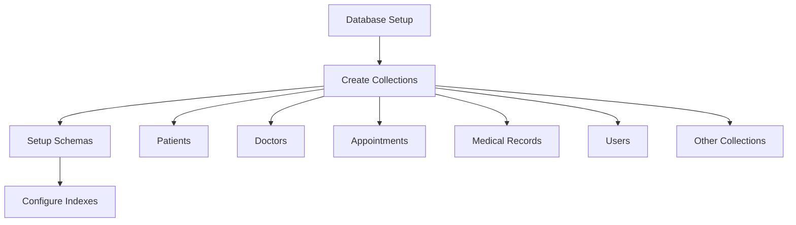
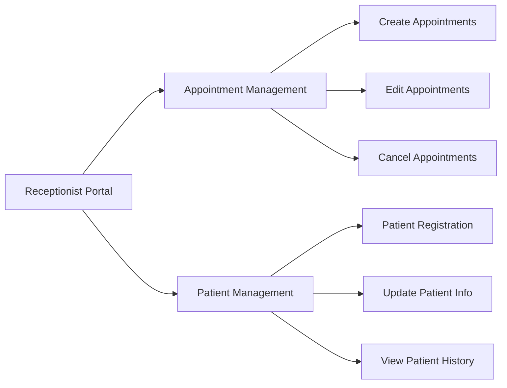
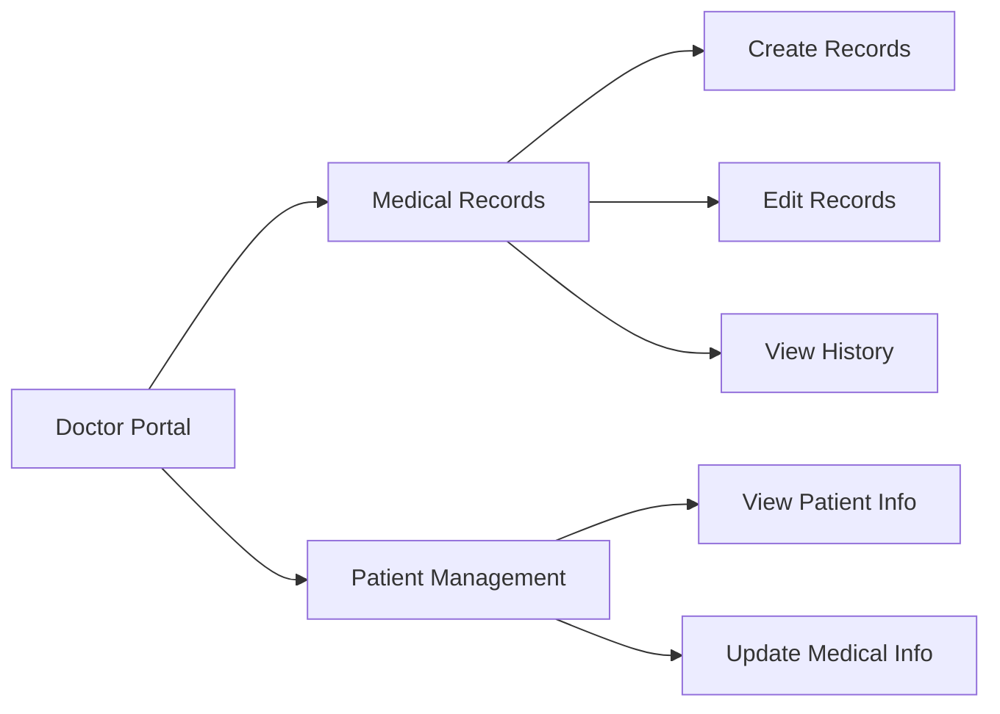

# Implementation Plan for Hospital Management System

## Overview
This plan outlines the steps to implement a hospital management system based on the provided database schema, focusing on receptionist and doctor functionalities.

## 1. Database Setup

### MongoDB Collections Setup

#### Required Collections:
- Patients
- Doctors
- Appointments
- Medical Reports
- Receptionists
- Medications
- Services
- Invoices
- Department
- Users
- Prescriptions

#### Key Features:
- Schema validation rules
- Proper indexing for optimized queries
- Referential integrity checks

## 2. Backend Enhancements

### API Route Improvements
- Enhanced appointment management
  * Conflict detection
  * Status tracking
  * Notification system
- Medical record management
  * Access control
  * Version tracking
  * Document attachments

### Security & Validation
- Input validation middleware
- Role-based access control
- Data sanitization
- Error handling improvements

## 3. Frontend Implementation

### Receptionist Portal

#### Features:
- Appointment scheduling interface
- Patient registration forms
- Schedule conflict resolution
- Basic patient information management
- Quick search functionality

### Doctor Portal

#### Features:
- Medical record creation/editing
- Patient history viewer
- Prescription management
- Test result uploads
- Treatment planning tools

## 4. Testing & Deployment

### Testing Phase
- Unit tests for all CRUD operations
- Integration testing
- Role-based access control verification
- Load testing for concurrent operations

### Deployment Steps
1. Database migration
2. Backend API deployment
3. Frontend deployment
4. Configuration updates
5. User acceptance testing

## 5. Future Enhancements
- Patient portal development
- Automated appointment reminders
- Analytics dashboard
- Mobile application support
- Integration with medical devices

## Timeline
- Database Setup: 2-3 days
- Backend Enhancements: 4-5 days
- Frontend Implementation: 7-10 days
- Testing & Deployment: 3-4 days

## Success Criteria
- Successful database migration with all collections
- Functional appointment management system
- Complete medical record management
- Role-based access working correctly
- System performance meets requirements